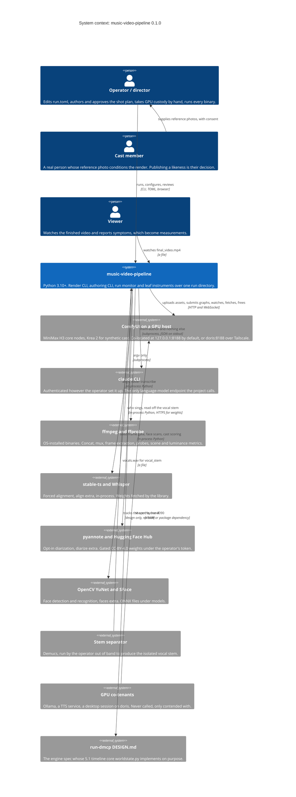
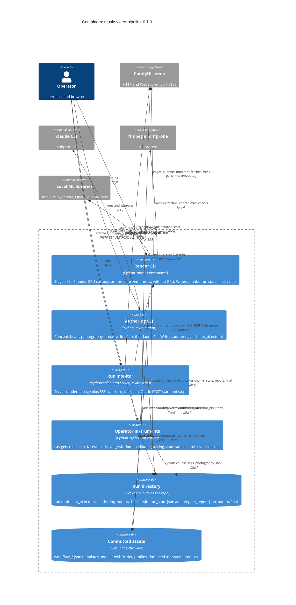
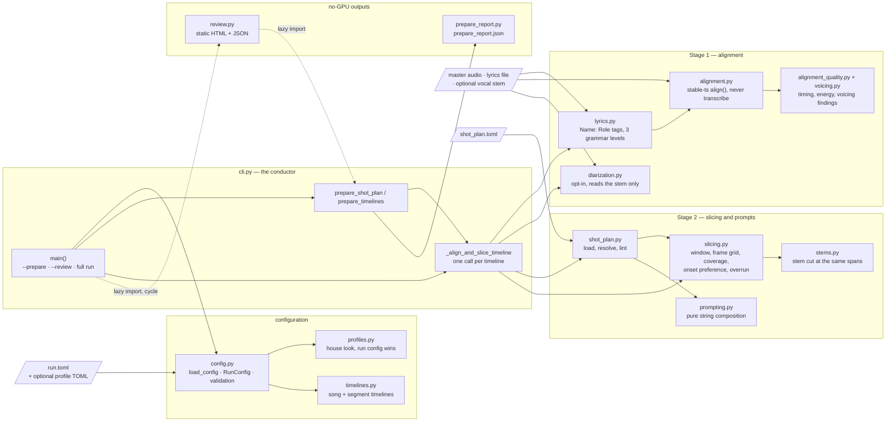
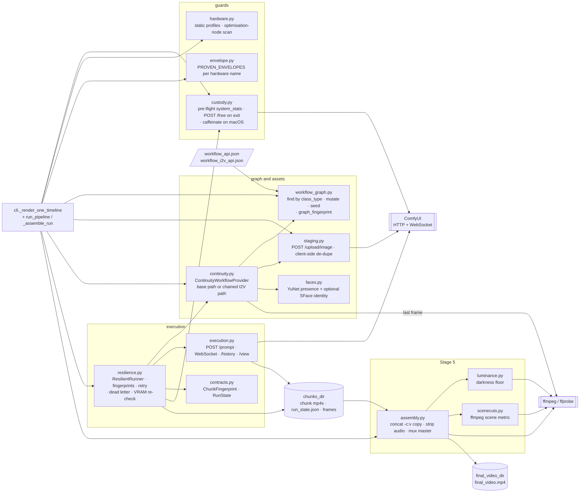
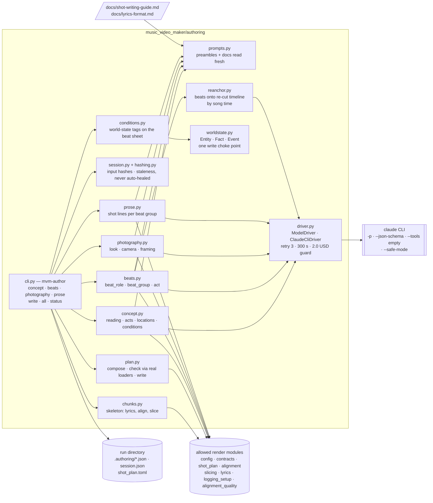
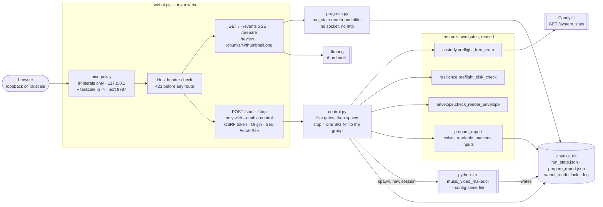
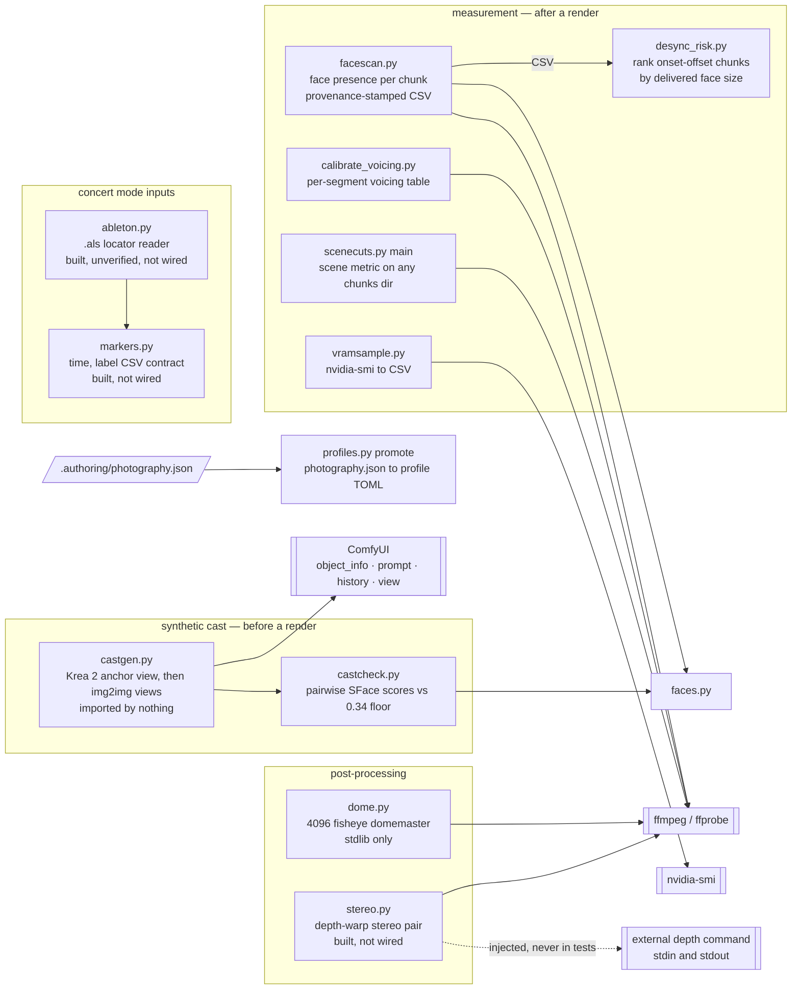

# music-video-pipeline architecture — C4 levels 1 to 3

This document describes music-video-pipeline (the Python package `music_video_maker`) with the
[C4 model](https://c4model.com): the system in its context (level 1), the containers it is made of
(level 2), and the components inside them (level 3). Level 4, code, is deliberately not here — it
changes faster than a document can follow, and the tests named in
[Boundaries that are enforced](#boundaries-that-are-enforced) are its real record.

It was written against package version **0.1.0** (`pyproject.toml`) at commit **ce2ffd5** on local
`main`, and describes the tree as it stood on **2026-10-05**. Counts, ports, paths and defaults
quoted here were read from the code or config on that date; where a test pins one, the test is
named. Where a statement is an inference rather than something the tree states outright, it says
so.

**This is not the authority for anything.** [../CLAUDE.md](../CLAUDE.md) holds the rules and the
measured lessons a change must respect, the module docstrings hold the reasoning behind each
mechanism, and the `docs/design-*.md` files hold designs — some built, some not, each saying which.
Where this document mentions a design it says whether it is **built**, **built but not wired**, or
**designed only**. This document only explains how the built thing is arranged so those are easier
to read.

The diagrams are Mermaid. Levels 1 and 2 use Mermaid's C4 notation; level 3 uses flowcharts,
because the C4 renderer does not lay out twenty components legibly.

---

## Level 1 — System context

music-video-pipeline **turns a master audio track, a lyrics file, cast reference photos and an
authored shot plan into a lip-synced music video, by driving a ComfyUI server that runs MiniMax H3
on a GPU.** The render itself contains no model call it authors — every prompt is deterministic
string composition — and the only place that asks a language model for anything is a separate
binary that writes a file a human reviews and commits.

It presents four surfaces to the outside:

| Surface | What it is | Who uses it |
|---|---|---|
| **`music-video-maker`** | The render CLI (`music_video_maker.cli:main`). One run TOML in; per-chunk mp4s, a run state file and a final mp4 out. Also `--prepare` (no-GPU skeleton + report) and `--review` (static HTML/JSON). | The operator, by hand or under `nohup`; or the monitor's control half, which spawns it. |
| **`mvm-author`** | The authoring CLI (`music_video_maker.authoring.cli:main`): concept, beats, photography, prose, write. Ends in a `shot_plan.toml`. | The operator, once per song, reviewing between stages. |
| **`mvm-webui`** | An HTTP monitor for one run (`music_video_maker.webui:main`), read-only unless started with `--enable-control`. | The operator in a browser, over loopback or Tailscale. |
| **`python -m` instruments** | Leaf tools: synthetic cast generation and scoring, face scans, desync ranking, fulldome and stereo post-processing, VRAM sampling, voicing calibration, profile promotion. | The operator, by hand, before or after a render. |

A fifth, indirect surface is **the run directory** (conventionally `~/mvm-runs/<song>/`, outside the
repository): the run TOML, the shot plan, `.authoring/`, `output/chunks/` and `output/final/`. Every
binary above reads or writes it, and it is the only thing they share.

*Styled copy: [Level 1 board](architecture/boards/Main.png).*

### What the context diagram is saying

- **The render calls no language model.** `music-video-maker` composes prompts with
  `prompting.py` (pure string composition) from an authored `shot_plan.toml`. The only code that
  calls a language model is `music_video_maker/authoring/`, behind the separate `mvm-author`
  console script, through `authoring/driver.py`'s `ClaudeCliDriver`, which shells out to `claude`
  with `--tools ""`, `--safe-mode` and `--output-format json`. That separation is enforced by
  `tests/test_authoring_boundary.py`, not just stated. Models *are* used on the render path —
  Whisper inside stable-ts, pyannote when `diarize = true`, YuNet/SFace for the seed-frame gate —
  but they are local, deterministic-by-configuration inference with no prompt anyone authors.
- **Every network call goes to one ComfyUI server.** `GET /system_stats`, `POST /upload/image`,
  `POST /prompt`, the `/ws?clientId=…` WebSocket, `GET /history/{prompt_id}`, `GET /view`,
  `POST /interrupt`, `POST /free`, and (castgen only) `GET /object_info`. There is no API client for
  any hosted model. The default `comfyui_url` is `http://127.0.0.1:8188` (`config.py`,
  `DEFAULT_COMFYUI_URL`); this project's own setup points it at `http://doris:8188` over Tailscale.
  Weights for stable-ts and pyannote are fetched by those libraries, not by this code (inference
  for stable-ts: it calls `stable_whisper.load_model(model_size)` and nothing else).
- **The GPU co-tenants are a context fact, not an integration.** Nothing in the package calls
  Ollama or the TTS service. They appear because the custody protocol exists to survive them:
  `custody.py` reads free VRAM before the run and `POST /free`s after it, and stopping the other
  tenants is deliberately a manual step (`custody.py`'s module docstring).
- **The run-dmcp link is design only.** `music_video_maker/authoring/worldstate.py` implements
  run-dmcp's DESIGN.md §5.1 Entity/Fact/Event timeline from the prose. Its one documented addition,
  `opened_by_event_id`, was added here first and has been in §5.1 since run-dmcp commit 430db2c
  (2026-09-12); its own docstring records both. It is **deliberate, not duplication**: a prototype
  held against a spec, written to be swapped for the real engine behind the same seam at that
  design's migration checkpoint. It imports nothing from the rest of the package, nothing in
  `pyproject.toml` depends on run-dmcp, and **nothing compares the two automatically** — a grep of
  `tests/`, `music_video_maker/`, `docs/` and the root docs finds run-dmcp named only in
  `worldstate.py` and its own test file. See discrepancy 8.
- **Distribution is out of frame.** There is no release workflow and no published package; the one
  GitHub Actions workflow is `.github/workflows/ci.yml` (lint and tests, below). The repository is
  written to become public (`CLAUDE.md` "Everything committed here is intended to become public"),
  which is why `tests/test_repo_assets.py` exists.

---

## Level 2 — Containers

A C4 container is a separately runnable or deployable thing: a process, a page, or a data store.
This system has four kinds of process and two data stores, and the only coupling between the
processes is files in the run directory — plus one spawn, from the monitor to the render CLI.

*Styled copy: [Level 2 board](architecture/boards/L2-Containers.png).*

### The containers

| Container | Technology | Responsibility | Notes |
|---|---|---|---|
| **Render CLI** | Python ≥ 3.10; `music_video_maker/cli.py`; console script `music-video-maker` | `main()` loads and validates the config, logs which real likenesses the run conditions on, then takes one of three paths: `--prepare` (`prepare_shot_plan`), `--review` (`review.build_review`), or the full run (`run_pipeline`). Exit codes distinguish success, error and partial failure (dead-lettered chunks). | The only process that takes GPU custody or writes chunk mp4s. Its core dependencies are deliberately light (`pydub`, `requests`, `websocket-client`); stable-ts, OpenCV, pyannote and numpy are extras. |
| **Authoring CLI** | Python; `music_video_maker/authoring/`; console script `mvm-author` | Seven subcommands: `concept`, `beats`, `prose`, `photography`, `write`, `all`, `status`. `all` runs concept → beats → photography → prose, stopping for approval between each, then `write`. | A **separate binary on purpose**: "does the render binary ever call a model?" stays answerable by reading `pyproject.toml`'s `[project.scripts]`. Adds no pip dependency. |
| **Run monitor** | Python stdlib `http.server`; `webui.py`, `progress.py`, `control.py`; console script `mvm-webui` | Serves `/`, `/events` (SSE), `/chunks/<id>/thumbnail.png`, `/prepare`, `/review`; with `--enable-control` also `POST /start` and `POST /stop`. | Binds IP literals only — `127.0.0.1` and this host's Tailscale IPv4 (`tailscale ip -4`) — on port **8787** by default. A start spawns `python -m music_video_maker.cli --config <same file>`; it never calls `run_pipeline` in-process. |
| **Operator instruments** | Python; leaf modules with their own `main()` | `castgen` (Krea 2 reference sets), `castcheck`, `facescan`, `desync_risk`, `dome`, `scenecuts`, `calibrate_voicing`, `vramsample`, `profiles promote`. | Nothing in the package imports `castgen` (tested). `stereo.py`, `markers.py` and `ableton.py` have no entry point and no caller: **built, not wired**. |
| **Run directory** | Filesystem | Everything a run produces and consumes. Relative paths in the run TOML resolve against the TOML's own directory (`config.py`). | Lives outside the repo by convention (`~/mvm-runs/<song>/`); `.authoring/` holds raw model replies and is gitignored belt-and-braces (`CLAUDE.md`). |
| **Committed assets** | Files in the checkout | Four ComfyUI API-format graphs (`workflow_api.json`, `workflow_i2v_api.json`, `workflow_cast_api.json`, `workflow_cast_view_api.json`), `models/face_detection_yunet_2023mar.onnx`, `profiles/`, `examples/`, and two docs the authoring layer reads at call time. | The SFace recognition model is **not** committed: `models/face_recognition_sface_2021dec.onnx` is gitignored, fetched by the operator, and required at config load only when `i2v_min_seed_face_similarity` is set. |

### Stage order and the artefacts handed between stages

This is the full run, `run_pipeline`, read from `cli.py`. Everything from template loading onward
happens inside `with prevent_host_sleep(), custody:`, so the custody pre-flight runs **before**
Stage 1 (see discrepancy 1).

| Step | Module | Consumes | Produces | Where |
|---|---|---|---|---|
| 0. Config | `config.load_config` (+ `profiles`, `timelines`) | run TOML; optional `cinematography_profile` TOML | `RunConfig`; one `Timeline` per `[[segment]]` plus the song | memory; `cinematography_profile.json` in `chunks_dir` when a profile is named |
| Custody | `custody.VramCustodyManager`, `prevent_host_sleep` | `GET /system_stats` | refusal below `min_free_vram_gb` (16.0); `caffeinate -w <pid>` on macOS only | ComfyUI; host |
| Templates | `workflow_graph.load_workflow_template`, `hardware.scan_workflow_for_missing_optimizations`, `custody.read_render_stack` | `workflow_template`, `i2v_workflow_template` | `Workflow` objects; ComfyUI and torch versions for the fingerprint | memory |
| 1. Align | `lyrics.parse_lyrics`, `alignment.align`, `alignment_quality` | timeline audio, script text | `AlignmentResult` with word timings; a quality report logged every run, fatal only under `strict_alignment` | memory, log |
| 1a. Diarize (opt-in) | `diarization.assign_characters` | `vocal_stem` | the same `AlignedSegment.characters` a `[Name: Role]` tag writes | memory |
| 2a. Slice | `shot_plan.load_shot_plan`, `slicing.slice_audio` | alignment, `hardware`, the plan's `length_seconds` | `AudioChunk` per chunk on H3's frame grid (24 fps, `5 + 17k` frames, trained 124–362) | `chunks_dir/chunk_NNN.wav` |
| 2a-stem (opt-in) | `stems.slice_stem_for_chunks` | `vocal_stem`, the chunks | each chunk's `audio_file` re-pointed at a stem slice, same spans | `chunks_dir/stem/chunk_NNN_vocal.wav` |
| 2b. Prompt | `cli.run_shot_plan_lints`, `prompting.expand_prompt` | chunk, plan entry, config | `ExpandedPrompt` per chunk (text + reference image) | memory |
| 3. Stage | `staging.ComfyUIAssetStager` | prompts' reference photos, chunk audio | server-returned filenames, de-duplicated client-side | ComfyUI's input directory |
| Envelope | `envelope.check_render_envelope` | chunks this invocation will render, resolution | refusal outside `PROVEN_ENVELOPES` unless `acknowledge_unproven_envelope` | — |
| 4. Render | `resilience.ResilientRunner`, `continuity.ContinuityWorkflowProvider`, `execution.ComfyUIExecutionClient` | mutated graph per chunk, `ChunkFingerprint` per chunk | one mp4 per chunk; run state persisted after every chunk; seed frames when chaining | `chunks_dir/chunk_NNNN.mp4`, `chunks_dir/run_state.json`, `chunks_dir/frames/` |
| 5. Assemble | `assembly.assemble_final_video` or `assemble_timelines`; `luminance`, `scenecuts` | chunk mp4s, run state, master audio | concat with `-c:v copy`, generated audio stripped, master muxed; darkness and scene-cut checks logged | `final_video_dir/final_video.mp4` (+ `concat_list.txt`, `_concat_intermediate.mp4`) |

Stage 5 is skipped for an `--only-chunks` slice (a partial concat would claim to be the whole song)
and whenever any chunk is dead-lettered. A config with `[[segment]]` tables runs Stages 1–4 once
per timeline, each with its own `chunks_dir/<segment>/` and its own `run_state.json`, then
`assemble_timelines` joins them and measures the seam.

### Ways to run it

| Variant | What runs | Touches the GPU? | Writes |
|---|---|---|---|
| `music-video-maker --config run.toml` (± `--resume`, `--reseed`, `--only-chunks`, `--timeline`) | Stages 1–5 | Yes, under custody | chunks, run state, final video |
| `music-video-maker --config run.toml --prepare [--from-plan P]` | Stages 1–2 only | No: no custody, no ComfyUI | `shot_plan.toml` skeleton (one per timeline) and `prepare_report.json` |
| `music-video-maker --config run.toml --review PATH` | Stages 1–2 + lints | No | `PATH.html` and `PATH.json` |
| `mvm-author --config run.toml all` | the four authoring stages + `write` | No | `.authoring/*.json`, `shot_plan.toml` |
| `mvm-webui --config run.toml [--enable-control]` | the monitor; a start spawns the first row | Only through the spawned CLI | `webui_render.lock` and `webui_render.log` beside `run_state.json` |
| Co-located (the default) | orchestrator and ComfyUI on one Linux GPU box | — | `prevent_host_sleep` is a no-op off darwin |
| Remote (this project's own) | orchestrator on a laptop, ComfyUI on doris | — | `comfyui_url = "http://doris:8188"` over Tailscale; `caffeinate` holds the laptop awake |

---

## Level 3 — Components

One source tree serves every container, so the component diagrams are of that tree. They are drawn
in five cuts along the seams the tests and the import graph actually enforce, not the directory
listing:

1. **Stages 1–2: planning the timeline** — the CPU-only half every mode shares.
2. **Stages 3–5: the render loop and assembly** — everything that talks to ComfyUI or ffmpeg.
3. **The authoring layer** — `authoring/`, the only language-model caller, walled off by
   `tests/test_authoring_boundary.py`.
4. **The monitor and its control half** — `webui.py`, `progress.py`, `control.py`.
5. **Leaf instruments** — modules nothing in the render path imports.

The direction across them is one-way and, for the parts that matter most, tested: nothing outside
`authoring/` imports `authoring/`; `authoring/` reaches the render half only through eight named
modules; nothing imports `castgen`; and the monitor reaches the render only by spawning it.
`contracts.py` — frozen dataclasses and `Protocol`s — is imported by 36 of the package's 57 other
Python files and imports nothing from the package itself (counted by AST walk, 2026-10-05; see
[stated but not enforced](#stated-but-not-enforced)).

### 3.1 Stages 1–2: planning the timeline

Shared verbatim by the full run, `--prepare`, `--review` and (through a deliberate four-call copy in
`authoring/chunks.py`) the authoring skeleton.

*Styled copy: [board 3.1](architecture/boards/L3-1-Stages-1-2.png).*

| Component | Source | Responsibility |
|---|---|---|
| **Conductor** | `music_video_maker/cli.py` | `main()` parses flags, builds overrides, loads the config and dispatches. `_align_and_slice_timeline` is the one Stages 1–2 sequence; `prepare_shot_plan` writes a skeleton per timeline, refusing all of them if any destination exists without `--force`, then the report. |
| **Config loader** | `music_video_maker/config.py` | TOML → frozen `RunConfig`, validated fast and loudly: file paths, URL, cast (`voiced_by`, `synthetic` + `origin`), hardware, segments, the SFace pre-flight when recognition is requested. Unknown top-level keys are ignored. |
| **Profiles** | `music_video_maker/profiles.py` | A versioned house look (`cinematography`, `face_treatment`, `lora`, `lora_strength`, `lora_trigger`) that fills fields the run config left unset. |
| **Timelines** | `music_video_maker/timelines.py` | `[[segment]]` prologue/epilogue as a second timeline with its own audio, script, chunk id space, chunks directory and run state. |
| **Lyrics** | `music_video_maker/lyrics.py` | Parses `[Name: Role]`, `[Name & Name]` and `[simultaneously]` tags into `LyricLine`s; the tag-stripped text is all the aligner ever sees. |
| **Aligner** | `music_video_maker/alignment.py` | Forced alignment through stable-ts `model.align()`, imported lazily; `alignment_model_size` (default `"base"`) is plumbed here; manual `alignment_overrides` apply to the song only. |
| **Alignment quality** | `alignment_quality.py`, `voicing.py` | Pure evaluators over the `AlignmentResult` plus ffmpeg `astats` energy reads; findings logged every run, CRITICAL ones refuse only under `strict_alignment`. Also names segments that may hold no voice, which slicing maps to chunk ids. |
| **Diarizer** | `music_video_maker/diarization.py` | Opt-in front-end that fills the same field tags fill; a tag in force wins and the clash is logged. pyannote is imported lazily. |
| **Slicer** | `music_video_maker/slicing.py` | The timeline: min/max window, H3's `5 + 17k` frame grid, instrumental coverage end to end, the leading-vocal-onset preference, optional boundary overrun. Writes one wav per chunk. Gets its "longest ever rendered" number from the previous run state via `envelope.measured_ceiling`. |
| **Stem cutter** | `music_video_maker/stems.py` | Cuts the isolated vocal stem at exactly the master's spans, for conditioning only. |
| **Shot plan** | `music_video_maker/shot_plan.py` | Loads and validates the authored plan, resolves per-chunk fields (`shot`, `camera`, `present`, `subject`, `location`, `conditions`, `framing`), raises `ShotPlanDriftError` when an entry's anchor no longer matches its chunk, and holds the shot-vs-lyric lints. |
| **Prompt composer** | `music_video_maker/prompting.py` | `expand_prompt`: deterministic concatenation of style, look, setting, cast, location, conditions, shot line and lyric clause; `prompt_format = "structured"` re-houses the same sentences in H3's own grammar. |
| **Prepare report / review** | `prepare_report.py`, `review.py` | Persist what `--prepare` found (`schema_version` 1) for the monitor; render a read-only review page from the same Stages 1–2 run. |

Three facts the directory listing hides:

- **`review.py` and `cli.py` import each other, both lazily.** The review reuses
  `cli.prepare_timeline` and `run_shot_plan_lints`; `cli.main` imports `review` inside the
  `--review` branch so the cycle never forms at import time.
- **`--prepare` reads only `length_seconds` from `--from-plan`, never the config's own plan.** The
  asymmetry with `--review` (which does read the config's plan) is documented in
  `_align_and_slice_timeline` and preserved on purpose.
- **Slicing moves boundaries relative to any older plan.** The onset preference and the tail fix
  re-cut chunks, so a plan authored against an older timeline is re-anchored with
  `--prepare --from-plan`, and `ShotPlanDriftError` catches the case where it was not.

### 3.2 Stages 3–5: the render loop and assembly

Everything here runs inside the custody block, and everything that waits on ComfyUI waits on a
WebSocket event, never a sleep.

*Styled copy: [board 3.2](architecture/boards/L3-2-Render-Loop.png).*

| Component | Source | Responsibility |
|---|---|---|
| **Custody** | `music_video_maker/custody.py` | `VramCustodyManager`: one free-VRAM reading against `min_free_vram_gb` on enter (unreadable degrades, below the floor refuses), unconditional `POST /free` on exit. `build_vram_probe` / `build_vram_releaser` are the seams the runner re-uses between chunks. `read_render_stack` records the ComfyUI and torch versions. |
| **Hardware** | `music_video_maker/hardware.py` | Static profiles (`PROFILE_RTX_4090_24GB`, `PROFILE_48GB`); deliberately never queries live VRAM. Reports which `recommended_nodes` a template lacks. |
| **Render envelope** | `music_video_maker/envelope.py` | Refuses a chunk larger, on any axis, than a frame-count/resolution point proven on the named card. Keyed by the exact `[hardware].name` string, so an unlisted name has no gate at all. |
| **Graph mutator** | `music_video_maker/workflow_graph.py` | Loads API-format templates and finds nodes by `class_type` (plus title or wiring), never by id; sets prompt, audio, image, length, size, seed, encoder and LoRA; `graph_fingerprint` is invariant under canvas renumbering. |
| **Asset stager** | `music_video_maker/staging.py` | Uploads images and audio through ComfyUI's one ingest endpoint and keeps the server-returned name; caches so a shared reference photo is uploaded once. |
| **Continuity provider** | `music_video_maker/continuity.py` | Per chunk, chooses the base reference path or the chained `MiniMaxH3ImageToVideo` path (`i2v_continuity`, `i2v_chain_scope`, `i2v_reanchor_interval`), extracts the predecessor's last frame with ffmpeg, gates it through `faces`, and re-stages it. |
| **Face gate** | `music_video_maker/faces.py` | YuNet detection (committed ONNX, recorded sha256) and optional SFace recognition against the cast photo; reports `detected` / `inconclusive` / `absent` / `unexamined`. |
| **Resilient runner** | `music_video_maker/resilience.py` | Renders a list of chunk ids: disk pre-flight, VRAM re-read (and, by default, release-and-wait) before every chunk, fingerprint comparison for `--resume`, interrupt → free → backoff → retry, dead-letter after `max_render_attempts`, atomic `run_state.json` (`RUN_STATE_SCHEMA_VERSION = 2`) after every chunk. |
| **Execution client** | `music_video_maker/execution.py` | One prompt per chunk with a UUID4 `client_id`; completion is the `executing` message with `node == null`; a WebSocket timeout or disconnect is reconciled against `/history` before it is believed. Writes `chunk_NNNN.mp4`. |
| **Assembly** | `assembly.py`, `luminance.py`, `scenecuts.py` | Concat demuxer with `-c:v copy`, all generated audio stripped, master muxed with `-shortest` (or no audio at all under `silent_output`, with a measured-duration check instead); overrun trims; post-render darkness and scene-cut checks at ERROR. |

Three facts the directory listing hides:

- **Two templates, not one mutated into the other.** The chained path is a different topology:
  `workflow_i2v_api.json` has `MiniMaxH3ImageToVideo` and two `LoadImage` nodes where
  `workflow_api.json` has `MiniMaxH3ReferenceToVideo` and one (counted from the files). Both carry
  ComfyUI's 1344×768 template default; `render_width`/`render_height` override it.
- **A cached chunk is a fingerprint match, not a file that exists.** `ChunkFingerprint` covers span,
  frame count, resolution, prompt hash, character, reference photo, seed, conditioning source and
  gain, encoder, LoRA, timeline and template hash; `--resume` re-renders anything whose
  inescapable tier moved, and records stack versions in a reportable tier.
- **"No sleep-polling" is about execution tracking.** Between chunks the runner does poll
  `/system_stats` through an injected sleeper while it waits for released VRAM to come back
  (`_release_and_wait`, every 2.0 s up to 120 s by default); its docstring says so (see
  discrepancy 13).

### 3.3 The authoring layer

The one place a language model is called, and the seam `tests/test_authoring_boundary.py` holds
from both sides.

*Styled copy: [board 3.3](architecture/boards/L3-3-Authoring.png).*

| Component | Source | Responsibility |
|---|---|---|
| **Authoring CLI** | `authoring/cli.py` | Subcommands and the approval loop; `--notes`, `--dry-run` (prints the prompts, calls nothing), `prose --groups`, `photography --candidates/--pick`, `write --revise-warnings` (off by default). |
| **Model driver** | `authoring/driver.py` | The only `subprocess` in the package that reaches a model. Stages are pinned to `claude-fable-5` (concept), `claude-opus-5` (beats, photography) and `claude-sonnet-5` (prose; also `--fallback-model`). `ScriptedDriver` replays canned replies in every unit test. |
| **Prompts** | `authoring/prompts.py` | Each stage's preamble plus `docs/shot-writing-guide.md` and `docs/lyrics-format.md`, read from disk on every call and hashed into provenance — the docs are part of the system prompt. |
| **Skeleton** | `authoring/chunks.py` | The chunk timeline every stage plans against, by repeating `cli.prepare_shot_plan`'s four Stage 1–2 calls, because importing `cli` is forbidden. |
| **Session** | `authoring/session.py`, `hashing.py` | `.authoring/session.json`: what was generated from which input hashes; a changed upstream reports downstream stages stale and regenerates nothing. |
| **Stages** | `concept.py`, `beats.py`, `photography.py`, `prose.py` | Hand-rolled validators over each reply; anchors (`chunk_id`, `start`, `end`) are always re-emitted from the skeleton, never taken from the model. |
| **Re-anchoring** | `authoring/reanchor.py` | When the beat sheet requests lengths, re-slices and maps each beat to the chunk containing its midpoint; a chunk no beat maps into goes back to the model. |
| **Plan writer** | `authoring/plan.py` | Composes TOML from frozen chunks, beats and prose; `check_plan` writes a temp file and runs the render's own `load_shot_plan` and lints; error revisions bounded at 2 rounds, warnings annotated as `# lint:`. |
| **World state** | `authoring/worldstate.py`, `conditions.py` | An event-sourced Entity/Fact/Event log with interval-versioned facts and one choke point (`set_fact`) for irreversibility; `conditions.py` writes a beat sheet's world-state tags into it and reports what the choke point refuses. |

Three facts the directory listing hides:

- **`worldstate.py` imports nothing from the package**, and its only in-package caller is
  `conditions.py` (through `WorldState` and `IrreversibleFactViolation`). `check_claim` and
  `check_location_tags` have no in-package caller; they are exercised by
  `tests/test_authoring_worldstate.py` (inference: and by ad hoc measurement runs that
  `CLAUDE.md` reports).
- **Nothing an authoring stage writes is read back into a render automatically.** The hand-off is a
  committed `shot_plan.toml`. The single exception crosses as a file, not an import:
  `python -m music_video_maker.profiles promote` reads `.authoring/photography.json` into a profile.
- **The allowlist is eight modules, not six.** The design named six; `logging_setup` and
  `alignment_quality` were added with reasons recorded in the test's docstring.

### 3.4 The monitor and its control half

*Styled copy: [board 3.4](architecture/boards/L3-4-Monitor-Control.png).*

| Component | Source | Responsibility |
|---|---|---|
| **Server** | `music_video_maker/webui.py` | Binding policy (loopback and Tailscale literals, `--bind` for more, hostnames refused), Host-header allowlist answering `421`, SSE re-reading `run_state.json` every `--poll-interval-seconds` (2.0), thumbnails via ffmpeg cached under the temp dir, and the control routes when enabled. |
| **Progress reader** | `music_video_maker/progress.py` | Reads `run_state.json` (rejecting a wrong or absent `schema_version`) and turns successive reads into events; excludes cached chunks from the finish projection. |
| **Controller** | `music_video_maker/control.py` | Refusals first: a run already in flight (lock file beside the run state), no or stale prepare report, short disk, held card, chunk outside the proven envelope. Then `sys.executable -m music_video_maker.cli --config <file>` with `start_new_session=True`; a stop is exactly one `SIGINT` to the child's process group, never `SIGKILL`. |

- **The write surface is two paths and is off by default.** Without `--enable-control`,
  `POST /start` and `POST /stop` are a flat `405`, like every other non-GET method.
- **Stricter than the CLI on purpose.** The CLI renders without a prepare report; the monitor
  refuses to start one unless the report exists and matches the files on disk.
- **The render does not know it is being watched.** The only channel is `run_state.json`, which
  `ResilientRunner` writes for `--resume` anyway.

### 3.5 Leaf instruments

Modules nothing on the render path imports, each run by hand with its own `main()` — or, for the
three marked unwired, not run by anything yet.

*Styled copy: [board 3.5](architecture/boards/L3-5-Instruments.png).*

| Component | Source | Responsibility |
|---|---|---|
| **Cast generator** | `music_video_maker/castgen.py` | Generates a reference set from a spec through `workflow_cast_api.json` (text-to-image) and `workflow_cast_view_api.json` (img2img from an earlier view's rendered file); checks the server's `object_info` enums, takes custody, scores with `castcheck`, records `filtering = "none"`. Design: `docs/design-synthetic-cast.md` (built; `CLAUDE.md` records that nothing had been generated when it landed). |
| **Cast scorer** | `music_video_maker/castcheck.py` | Pairwise SFace similarity across a reference set against the 0.34 floor calibrated on photographs of real people. |
| **Face scan / desync rank** | `facescan.py`, `desync_risk.py` | Per-chunk face presence with input path, size, mtime and model sha256 recorded; `desync_risk` joins that CSV with the render log's onset-offset warnings. |
| **Calibration and sampling** | `calibrate_voicing.py`, `vramsample.py` | Print every placed segment's voicing statistics; poll `nvidia-smi` beside an attended render. Neither is imported by anything. |
| **Fulldome** | `music_video_maker/dome.py` | Post-render domemaster via ffmpeg `v360`: 16-bit PNG master, H.265 copy, six 5.1 stems with a 2-pop, conformance check. Design: `docs/design-fulldome.md`. |
| **Stereo** | `music_video_maker/stereo.py` | Depth-image-based stereo pair and anaglyph; vectorised with numpy when present, byte-identical loop otherwise. **Built, not wired**, and per its own docstring almost none of it has run on real footage. |
| **Concert-mode markers** | `markers.py`, `ableton.py` | A `(time, label)` CSV contract and an Ableton `.als` reader producing it. **Built, not wired** into `cli.py`; the Ableton reader is **unverified** against a real set file (`docs/design-concert-mode.md`). The parts of concert mode that are wired are `silent_output` and the measured-duration check in assembly. |

---

## Presentation copies, and how fast they rot

A hand-laid, styled copy of each of the seven diagrams above lives in [architecture/](architecture/):
the board sources under `canvas/`, rendered PNGs under `boards/`, and a `render.py` that regenerates
the PNGs with Playwright's Chromium (not a dependency of this package; the script's docstring says
how to get it). They exist for onboarding, a README hero, or a talk. **They are not the source of
truth and are never edited by hand.** The Mermaid in this file is what a pull request diffs; a board
is redrawn from this file when the file changes, and when the two disagree, this file wins.

Expect the boards to drift, and expect the detailed ones to drift first:

| Board | Goes stale when | Expected drift |
|---|---|---|
| Level 3.1 to 3.5, components | a module is added or moves across the authoring boundary, a stage gains a step, a route or instrument lands | fast, with almost every feature issue |
| Level 2, containers | a process, protocol, artefact or run shape changes | medium, a few times a year |
| Level 1, system context | a new kind of actor or external system appears | slow, rarely |

Each board's footer states the commit it was drawn from and its expected drift. When a count in
this file changes, the board that quotes it is wrong until it is redrawn; that is acceptable, and
the footer says so.

---

## Boundaries that are enforced

The arrangement above is not a convention where a test says otherwise. Each row names a test that
goes red when the line is crossed; the test is the durable record and this table is the map to it.

| Boundary | Test | What goes red |
|---|---|---|
| Nothing outside `authoring/` imports `music_video_maker.authoring` in any spelling | `tests/test_authoring_boundary.py::test_no_module_outside_authoring_imports_the_authoring_package` | Names the file, line and import (AST parse, never import) |
| No `subprocess` outside `authoring/` except a 12-entry, per-file-justified allowlist | `tests/test_authoring_boundary.py::test_no_module_outside_authoring_shells_out_via_subprocess` | A new `subprocess` import outside `SUBPROCESS_ALLOWLIST` |
| `castgen` is a leaf: nothing in the package imports it | `tests/test_authoring_boundary.py::test_nothing_in_the_package_imports_the_image_generator` | Any import of `music_video_maker.castgen` |
| `authoring/` reaches the render half only through 8 named modules (never `cli`) | `tests/test_authoring_boundary.py::test_authoring_only_imports_the_allowed_render_side_modules` | An import outside `ALLOWED_AUTHORING_IMPORTS` |
| `worldstate.py` carries no client-specific vocabulary | `tests/test_authoring_worldstate.py::test_worldstate_module_source_contains_no_client_specific_vocabulary` | A forbidden word in the module source |
| The authoring `framing` vocabulary is the render's own, never copied | `tests/test_authoring_photography.py::test_framing_vocabulary_is_the_render_paths_own` | A second copy of `prompting.FRAMING_LEVELS` |
| Committed binaries declared with provenance; real likenesses need recorded consent; `.env` ignored; diarization weights never committed; CC-BY attribution emitted at runtime | `tests/test_repo_assets.py` | An undeclared or vanished asset, an unconsented likeness, a committed weight file |
| Every profile look field has fingerprint evidence; the committed house profile refuses to load | `tests/test_profiles.py::test_every_look_field_has_fingerprint_evidence`, `::test_the_committed_house_profile_is_a_skeleton_that_refuses_to_load` | A look field `--resume` could not see change; a profile that loads unapproved values |
| Heavy ML stacks are never imported at module load | `tests/test_alignment.py::test_module_import_does_not_pull_in_stable_whisper_or_torch`, `tests/test_diarization.py::test_importing_this_module_does_not_import_pyannote`; CI's core-only install | An eager import of an extra |
| Forced alignment only, never transcription | `tests/test_alignment.py::test_align_never_calls_transcribe` | A call to `transcribe` |
| Execution tracking never sleeps | `tests/test_execution.py::test_execution_source_contains_no_sleep_call`, `tests/test_resilience.py::test_real_time_sleep_is_never_called` | A `sleep` in the execution source; a real `time.sleep` in the runner |
| Nodes are found by `class_type`, so canvas renumbering changes nothing | `tests/test_workflow_graph.py::test_mutate_finds_the_noise_node_after_a_canvas_renumbering`, `::test_graph_fingerprint_is_unchanged_by_a_canvas_renumbering` | A hardcoded node id |
| Custody is released unconditionally | `tests/test_custody.py::test_exit_calls_free_even_when_the_body_raises`, `tests/test_cli.py::test_run_pipeline_frees_comfyui_vram_even_when_the_pipeline_raises` | A path that skips `POST /free` |
| `--prepare` touches no ComfyUI | `tests/test_cli.py::test_prepare_shot_plan_writes_a_skeleton_touching_no_comfyui` | Any request to the mock server |
| The structured prompt re-houses the prose prompt's own sentences | `tests/test_prompt_format.py::test_every_prose_sentence_but_the_lyric_survives_verbatim` | A sentence that differs between formats |
| The config's seed bound mirrors the mutator's | `tests/test_config.py::test_config_seed_bound_mirrors_the_mutator_bound` | The two constants diverging |
| The review artefact is deterministic | `tests/test_review.py` (golden HTML and JSON, byte-identical across builds) | A diff against `tests/fixtures/review/` |
| The monitor binds only loopback/Tailscale literals, answers `421` to a foreign Host before any route, and has no write route without `--enable-control` | `tests/test_webui.py` (`TestValidateBindAddress`, `TestHostHeaderOverHTTP`, `test_start_and_stop_are_405_when_control_is_not_enabled`, the cross-site and token refusals) | Real sockets accepting what they should refuse |
| A start spawns this interpreter's own CLI module; a stop is one `SIGINT` and never escalates | `tests/test_control.py::test_it_runs_this_interpreters_own_cli_module`, `::test_stop_sends_exactly_one_sigint_to_the_childs_process_group`, `::test_stopping_twice_sends_a_second_sigint_and_never_escalates` | An in-process start, or a `SIGKILL` |
| A run state of the wrong or absent schema is refused, not misread | `tests/test_progress.py::test_read_run_state_wrong_schema_version_raises_progress_error`, `::test_read_run_state_absent_schema_version_raises_progress_error` | A silent read of an old file |
| The numpy stereo warp matches the loop byte for byte | `tests/test_stereo.py`, run by CI in a separate step after installing `[stereo]` | Any differing byte |
| 80% branch coverage | `pyproject.toml` `--cov-fail-under=80` (with `contracts.py` omitted from measurement) | The whole run |

CI (`.github/workflows/ci.yml`) runs on push to `main` and on pull requests, on Python 3.10–3.13:
`pip install -e ".[dev]"`, `ruff check .`, `pytest -m "not integration"`, then
`pip install -e ".[stereo]"` and `pytest tests/test_stereo.py -m "not integration" --no-cov`.
Tests are fully offline: `tests/harness/` fakes ComfyUI's HTTP endpoints and scripts its WebSocket.
As of 2026-10-05 there are 67 `tests/test_*.py` files and 15 `@pytest.mark.integration` decorators
across 7 of them (real ffmpeg, or the real `claude` binary in `test_authoring_driver.py`), all
deselected in CI.

### Stated but not enforced

Each of these is true of the tree today (checked by AST walk on 2026-10-05) and is asserted in a
docstring, but no test goes red if it stops being true:

- `contracts.py` imports no stage module, ComfyUI client, torch or pydub.
- `dome.py` is stdlib-only (it imports only `array` and `subprocess` beyond the usual stdlib).
- `progress.py` and `control.py` import no `http` and no `socket`.
- `worldstate.py` matches run-dmcp's DESIGN.md §5.1 — compared by hand only, if at all.

---

## Configuration reference

### Environment variables

The package reads exactly one kind of environment variable (grep for `environ` / `getenv`,
2026-10-05):

| Variable | Read by | Effect |
|---|---|---|
| `HF_TOKEN`, then `HUGGINGFACE_HUB_TOKEN`, then `HUGGING_FACE_HUB_TOKEN` | `diarization.py` (`PYANNOTE_TOKEN_ENV_VARS`) | Hugging Face token for the gated pyannote pipelines. Only consulted when `diarize = true`; never read from the run config. |

Binaries looked up on `PATH`: `ffmpeg`/`ffprobe` (render, monitor thumbnails, instruments), `claude`
(`mvm-author` only), `caffeinate` (macOS only, `prevent_host_sleep`), `tailscale` (`mvm-webui` bind
discovery), `nvidia-smi` (`vramsample` only).

### The run TOML (`RunConfig`, `config.py`)

Relative paths resolve against the TOML file's own directory. Every top-level key must appear above
the first table header, because TOML binds a bare key to the preceding table and unknown keys are
ignored (`examples/first-run.toml` explains the failure this caused). Defaults below are the
dataclass defaults; `load_config` derives the two state-file paths.

| Group | Keys (default) | Effect |
|---|---|---|
| Required inputs | `master_audio`, `lyrics_file`, `global_style`, `narrative_concept`, `cast`, `default_lead_vocalist`, `workflow_template`, `chunks_dir`, `final_video_dir`, `[hardware]` with `name` and `vram_gb` | The run. `chunks_dir` and `final_video_dir` are created if absent. |
| ComfyUI | `comfyui_url` (`http://127.0.0.1:8188`), `text_encoder` (template's), `lora` (none), `lora_strength` (1.0), `lora_trigger`, `noise_seed` (0), `render_width`/`render_height` (template's 1344×768) | Where and how chunks render; the encoder, LoRA and seed are fingerprinted. |
| Resilience | `watchdog_timeout_seconds` (900.0), `max_render_attempts` (3), `retry_backoff_seconds` (5.0), `min_free_disk_gb` (20.0), `run_state_file` (`chunks_dir/run_state.json`), `prepare_report_file` (`chunks_dir/prepare_report.json`) | Retry, dead-letter and resume. |
| Custody | `min_free_vram_gb` (16.0), `between_chunk_min_free_vram_gb` (none), `release_vram_between_chunks` (true), `acknowledge_unproven_envelope` (false) | Pre-flight floor, between-chunk release, envelope override. |
| Alignment | `alignment_model_size` (`"base"`), `strict_alignment` (false), `alignment_overrides` (none), `vocal_stem` (none), `diarize` (false), `[diarization_speakers]`, `transcript_file` (none) | Which Whisper size decides how much is sung; refusal on critical findings; stem conditioning; diarization; a stem transcript as a second witness (#105). |
| Timeline | `instrumental_coverage` (true), `boundary_overrun` (false), `instrumental_shot_seconds`, `instrumental_audio_gain_db`, `[[segment]]` tables, `silent_output` (false), `duration_tolerance_seconds` | Coverage of the whole track, overrun rendering, prologue/epilogue timelines, the concert-backdrop path. |
| Prompt content | `setting`, `cinematography`, `cinematography_profile`, `global_appearance`, `global_demeanour`, `face_treatment` (`"flattering"`), `avoid` (authoring only), `song_facts`, `lyric_literalness` (`"thematic"`), `prompt_format` (`"prose"`), `lyric_language` (`"English"`), `shot_plan` | What every prompt composes. `lyric_literalness` is read by authoring and lint levels, never by the render's lyric clause. |
| Chaining | `i2v_continuity` (false), `i2v_workflow_template`, `i2v_chain_scope` (`"instrumental"`), `i2v_reanchor_interval`, `i2v_require_seed_face` (true), `i2v_min_seed_face_fraction`, `i2v_min_seed_face_similarity` (none = recognition off) | The I2V path and its face gate. `boundary_overrun` and `prompt_format = "structured"` are each refused alongside `i2v_continuity`. |
| Resume | `resume_ignore_prompt_changes` (false), `resume_require_same_stack` (false) | Whether a prompt edit or a ComfyUI/torch change forces a re-render. |
| `[hardware]` | `name`, `vram_gb` (required); `min_chunk_seconds` (124/24 s), `max_chunk_seconds` (362/24 s), `recommended_nodes` | The chunk window and the envelope key. Only `name = "RTX 4090 24GB (doris)"` has proven envelope points. |
| `[cast.<Name>]` | `role`, `image`, `appearance`, `demeanour`, `voiced_by`, `synthetic`, `[cast.<Name>.origin]` | Who is in the video and whose likeness it depends on. |

### Command-line flags

| Binary | Flags (default) |
|---|---|
| `music-video-maker` | `--config` (required), `--resume`, `--ignore-prompt-changes`, `--strict-alignment`, `--only-chunks IDS`, `--reseed IDS`, `--reseed-generation N`, `--prepare`, `--shot-plan-out PATH` (`shot_plan.toml` next to the config), `--force`, `--from-plan PATH`, `--review PATH`, `--timeline NAME` (song), `--log-level` (INFO) |
| `mvm-author` | `--config`, `--log-level`, `--timeout-seconds` (driver's 300 s); subcommands `concept`, `beats`, `prose`, `photography`, `write`, `all`, `status` |
| `mvm-webui` | `--config` (required), `--bind` (repeatable), `--port` (8787), `--allow-host` (repeatable), `--review-html PATH`, `--thumbnail-cache-dir` (`<tempdir>/mvm-webui-thumbnails`), `--enable-control`, `--poll-interval-seconds` (2.0), `--log-level` |

### Other files a run reads or writes

| File | Owner | Notes |
|---|---|---|
| `shot_plan.toml` | written by `--prepare` (skeleton) or `mvm-author write`; read by the render | Anchors come from the chunks; a human reviews and commits it. |
| `chunks_dir/run_state.json` | `resilience.py` | `schema_version` 2; grows by optional fields, not schema bumps. |
| `chunks_dir/prepare_report.json` | `prepare_report.py` | `schema_version` 1; the monitor's start gate. |
| `chunks_dir/cinematography_profile.json` | `profiles.write_profile_record` | The resolved look, recorded before any GPU time. |
| `<run dir>/.authoring/` | `authoring/` | `session.json`, `concept.json`, `beats.json`, `photography.json`, `photography_candidates.json`, `prose.json`, `raw/`. |
| `profiles/*.toml`, `examples/profiles/*.toml` | `profiles.py` | The committed house profile is a skeleton that refuses to load; the example loads. |
| `models/*.onnx` | `faces.py` | YuNet committed; SFace gitignored and fetched by the operator. |

---

## Discrepancies found while writing this

Thirteen turned up while this document was being written, and a fourteenth while they were being
verified. Every one is the same shape: a fact stated in one place — a comment, a docstring, a doc,
a dependency list — that nothing compared against the place the fact lives. All fourteen were
verified against the code before anything was changed, and in every case the code was right and
the prose was wrong, except item 2 (a real defect in `config.py`) and item 7 (a dead dependency).
All fourteen are fixed. One new test holds item 2; where an existing test holds the rule behind an
item, the item names it; the rest are prose that no test can hold. Nothing in the render path
behaves differently. Two things remain open, at the end.

1. **`cli.run_pipeline`'s comment said alignment runs before custody is taken.** It is the other
   way round: `prevent_host_sleep()` and `custody` are entered in one `with`, and every timeline's
   alignment and slicing run inside it, so the free-VRAM pre-flight precedes Stage 1. Fixed: the
   comment now says so. No test; [Stage order](#stage-order-and-the-artefacts-handed-between-stages)
   above describes the same order.
2. **`RunConfig` declared `i2v_continuity`, `i2v_workflow_template` and `min_free_vram_gb`
   twice.** A real defect, not prose: a redeclared dataclass field raises nothing, the later default
   and docstring silently win, and an edit to the earlier one does nothing. The defaults happened to
   agree. Fixed by deleting the later copies, which leaves every field's position, type and default
   unchanged (`dataclasses.fields(RunConfig)` is identical before and after, all 63 entries, because
   a field keeps the position of its first declaration). The two `min_free_vram_gb` docstrings were
   reconciled into one: the surviving rationale is the lowest free VRAM a render has demonstrably
   succeeded at (~16.4 GB), which `custody.DEFAULT_MIN_FREE_VRAM_GB` and the 16.0 default both
   carry; the other's "19995 MB is a hard floor for any run" is contradicted by that default and by
   those measurements, and the merged docstring says why it was dropped. Both copies arrived in the
   repository's root commit, so `git blame` cannot date them. Held by
   `tests/test_config.py::test_runconfig_declares_no_field_twice` (AST walk of the class body).
3. **README said nothing listens to the audio for the singer, and that detection was not built.**
   `diarization.py` (#101) is built. Fixed in "What it does": tags are still the default and win,
   and diarization is named as opt-in (`diarize = true`), with unmeasured thresholds and the claim
   not made. No test.
4. **README and `CLAUDE.md` called `suppress_silence=True` VAD.** `alignment.py` passes
   `suppress_silence=True, regroup=True` and nothing else, and its #96 correction records that this
   selects stable-ts's volume-quantisation mask with `vad` left at its default of false. Fixed in
   both places. No test.
5. **CONTRIBUTING said `-m "not integration"` deselects "the two tests".** There are 15
   `@pytest.mark.integration` decorators across 7 files, collecting as 19 tests with
   parametrisation, and some want a real render under `~/mvm-runs/` rather than a binary. Fixed with
   wording that needs no number and names `pytest --collect-only -q -m integration`; the same "Both
   self-skip" in `ci.yml`'s comment was fixed with it. No test.
6. **CONTRIBUTING said CI runs "exactly the two commands above, on the core install plus `[dev]`
   only".** `ci.yml` then installs `[stereo]` and runs `tests/test_stereo.py`. Fixed. No test.
7. **`ffmpeg-python` was a core dependency nothing imports.** A search of the package, tests,
   examples and docs found no `import ffmpeg` and no use of its API; every ffmpeg call is
   `subprocess` argv. Removed from `pyproject.toml`, and `CLAUDE.md`'s stack line now lists the real
   core dependencies and says `stable-ts` and `torch` come only with extras. No test: nothing checks
   that a declared dependency is imported. The installed `*.egg-info` still lists it until the next
   `pip install -e .`.
8. **`worldstate.py` called `opened_by_event_id` an addition beyond the spec, and cited "FINAL DRAFT
   v1.0".** run-dmcp's DESIGN.md §5.1 has carried `opened_by_event_id NULL` on `facts` since commit
   430db2c (2026-09-12, run-dmcp#30), and DESIGN.md has been "ACCEPTED v1.0, 2026-08-18" since its
   first commit there (no revision of it ever said "FINAL DRAFT"). Fixed: the docstring cites the
   accepted version, says the field was added here first and why, and that it is spec now. A
   field-by-field comparison found further divergences, which are **open** (below).
9. **`music_video_maker/__init__.py` cited "the blueprint PDF".** No PDF has ever been tracked on
   any ref. Fixed: it now calls the blueprint an original design document never tracked here and
   points at `CLAUDE.md` and this file. No test.
10. **Telegram/Telethon appeared in the docs but not the code.** Nothing imports a Telegram client,
    and `git log --all -S Telethon` finds only prose, all from the root commit: the integration
    `docs/doris-gpu-setup.md` describes was removed before this repository's history begins, so
    that doc's "it is in the git history" was false too. Fixed in `CLAUDE.md` (the `.env` rule kept,
    Telegram scoped to history), CONTRIBUTING (pyannote, which tests do fake, replaces Telethon in
    the offline list), `docs/doris-gpu-setup.md`, and the assertion message in
    `tests/test_repo_assets.py::test_dotenv_is_ignored`, which still holds the `.env` rule.
11. **`authoring/chunks.py` listed six allowed render imports.** The test allows eight, and
    `chunks.py` itself imports `alignment_quality`. Fixed: the docstring names
    `ALLOWED_AUTHORING_IMPORTS` in `tests/test_authoring_boundary.py` as the authority and lists its
    eight as of writing. The test holds the set; nothing holds the docstring's copy.
12. **`authoring/__init__.py` said the package is the only place that shells out for inference.**
    `stereo.external_depth_source` pipes frames to an external depth-model command. Fixed: the
    package is the only place that talks to an LLM, and the docstring names the stereo exception
    and its reason the way the boundary test's `SUBPROCESS_ALLOWLIST` entry for `stereo.py` does.
    The allowlist holds the subprocess side; nothing holds the docstring.
13. **README said "there is no polling loop anywhere in the render path".** `ResilientRunner`
    polls `/system_stats` after a between-chunk release (`_release_and_wait`, on by default). Fixed:
    the README now scopes the rule to execution tracking and names the one bounded poll, as
    `CLAUDE.md`'s invariant and the method's own docstring already did.
14. **`resilience.py`'s module docstring said "No sleep-polling anywhere in this module".** Found
    while verifying 13: `_release_and_wait`, in that module, sleeps between readings. Fixed the same
    way. `tests/test_resilience.py::test_real_time_sleep_is_never_called` holds the part that
    matters (the sleeper is injected, never a real `time.sleep` in tests).

**Open, and why.**

- **`worldstate.py` against §5.1, beyond item 8.** No automated check exists and none was added
  (the reimplementation is deliberate, and a test importing run-dmcp is exactly what it must not
  have). Compared by hand on 2026-10-05: (a) `Fact.contradicted_by` is a second field beyond §5.1,
  caller-injected vocabulary for `check_claim`, documented in the module but not as a spec
  divergence; (b) §5.2c has the engine stamp `opened_by_event_id` when the fact opens, while here it
  is optional and caller-supplied, so a fact can open with no recorded hop; (c) destruction is
  recorded twice — `Entity.destroyed_at_t` and an irreversible reserved `__destroyed__` fact — where
  §5.1 has only the column; (d) §5.1's `events.causes JSON` is a tuple of id strings here; (e) `t`
  is a bare float, where §5.1 asks for an opaque ordinal with a declared comparator (a float is one,
  with the comparator implicit). None of these is a bug in the prototype; each is a place a later
  swap to the engine would have to decide.
- **`diarization._token_hint` says "this project reads .env".** Nothing in the package loads
  `.env`; the token is read from the process environment. Left alone because it is a runtime
  message, not a comment: whether to load `.env` or to reword the hint is a decision, not a
  correction.

---

## Maintaining this document

- It is levels 1 to 3 only. Do not add function signatures, line numbers or exhaustive flag lists
  beyond what is here; those rot, and the tests above are their record.
- When a count changes (allowlist entries, allowed authoring imports, integration tests, test
  files, schema versions), change it here in the same commit and name the test or file it came
  from.
- When a new boundary test lands, add a row to
  [Boundaries that are enforced](#boundaries-that-are-enforced); when a "stated but not enforced"
  claim gets a test, move it up.
- When a design in `docs/design-*.md` moves from designed to built, or from built to wired, update
  the component that names it.
- If run-dmcp's DESIGN.md §5.1 or `authoring/worldstate.py` changes, compare the other by hand: this
  document can only record that nothing else will.
- Styled board copies live under `architecture/` and are redrawn from the Mermaid here; see
  [Presentation copies](#presentation-copies-and-how-fast-they-rot).
